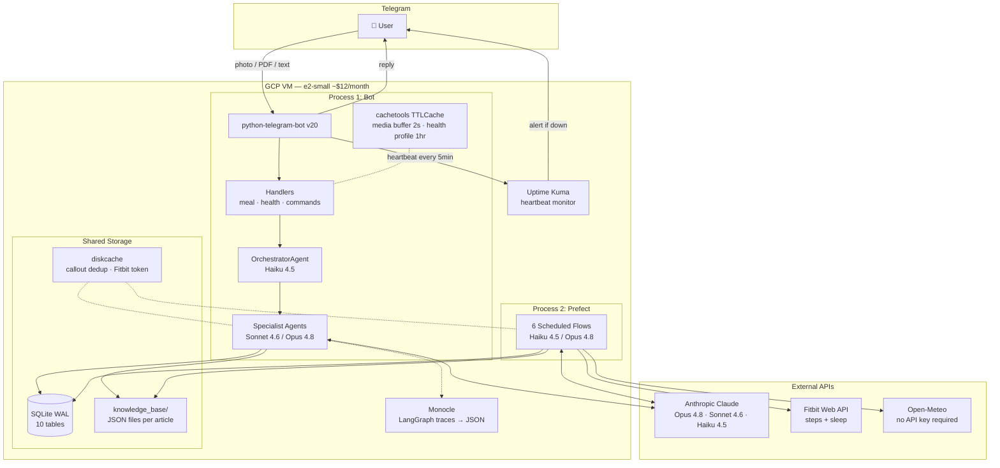
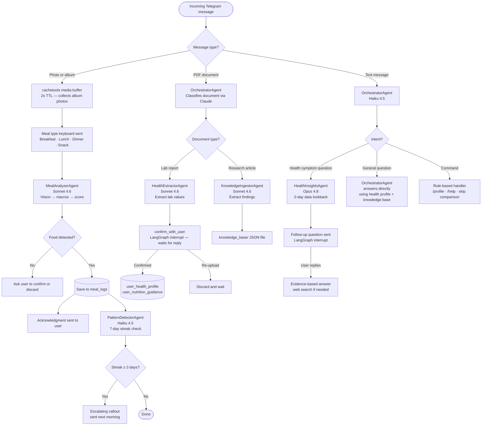
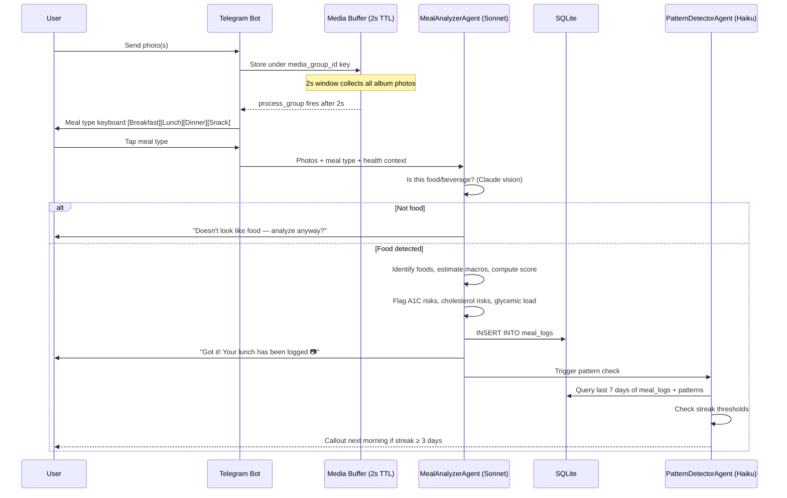

# FitAi 🥗

**A personal AI nutritionist Telegram bot** — built to reduce A1C, lower LDL, raise HDL, and stay physically fit. Not a generic meal tracker. Every message, nudge, and report connects back to real health targets grounded in your actual lab results.

Built with a LangGraph multi-agent system, three tiers of Claude (Opus / Sonnet / Haiku), and a Prefect scheduling layer — running on a single GCP VM for ~$12/month.

---

## What This Is

FitAi acts as a proactive health accountability partner over Telegram. Snap a photo of your meal, upload a lab report PDF, or ask a health question — it handles the rest.

- **Meal photos** are analyzed using Claude's vision, macro-estimated, scored against your personal A1C and cholesterol targets, and saved to a local SQLite database
- **Lab reports** (PDF) are extracted, confirmed with you, and used to auto-generate personalized nutrition rules
- **Research articles** (PDF) are ingested into a knowledge base that grounds every recommendation in peer-reviewed findings
- **Health questions** ("why am I bloated?") get evidence-based answers using your last 2 days of meals, steps, and sleep
- **Pattern streaks** — 3+ consecutive days of high glycemic load, skipped meals, low steps — trigger escalating callouts
- **Morning briefings, daily summaries, and weekly reports** run on a Prefect schedule automatically

---

## Features

| Feature | Description |
|---|---|
| 📷 Meal photo logging | Multi-photo album support, beverage detection, non-food rejection |
| 🔬 Health profile | Upload lab report PDF → extract A1C, LDL, HDL → generate personalized nutrition rules |
| ☀️ Morning briefing | Steps + sleep + weather + motivational quote, daily at 10:30am PST |
| 🍽 Missed meal alerts | 3pm and 10:30pm checks — alert only fires if meal was not logged |
| 📊 Daily summary | Macro totals, dietary score, A1C/cholesterol flags, one improvement for tomorrow |
| 🔁 Pattern detection | 7-day streak tracking with escalating tone: informational → firm → health warning |
| 📅 Weekly report | Score delta, recommendation follow-through comparison, correlations, honest verdict |
| 🧠 Health Q&A | Conversational symptom questions with 2-day data lookback and web search (permission-gated) |
| 📚 Knowledge ingestion | Upload research articles → findings ground all agent recommendations |
| 🧬 Semantic memory | Weekly extraction of behavioral facts from 90-day history, injected into agents |

---

## Architecture

### System Overview



---

### Agent Routing Flow

All real-time Telegram messages go through the OrchestratorAgent. Scheduled jobs bypass it entirely and call agents directly via Prefect.



---

### Meal Logging Data Flow



---

### Scheduled Flows (America/Los_Angeles)

```mermaid
gantt
    title Daily and Weekly Scheduled Flows
    dateFormat HH:mm
    axisFormat %H:%M

    section Every Day
    Morning briefing — Fitbit steps + sleep + weather + quote      :10:30, 30m
    Lunch alert — check if breakfast or lunch logged               :15:00, 15m
    Dinner alert — check if dinner logged                          :22:30, 15m
    Daily summary — DailySummaryAgent + PatternDetectorAgent       :23:30, 30m

    section Sunday Only
    Semantic memory extraction — 90-day behavioural facts          :18:00, 60m
    Weekly report — WeeklyReportAgent + PatternDetectorAgent       :20:00, 60m
```



Each flow has 3 retries with 60s delay and sends a Telegram failure alert if all retries are exhausted.

---

## Tech Stack

| Layer | Choice | Notes |
|---|---|---|
| Language | Python 3.11+ | |
| Telegram | python-telegram-bot v20+ | Async, built-in JobQueue |
| Multi-agent | LangGraph v0.4+ + langchain-anthropic | DAG-based routing, `AsyncSqliteSaver` for checkpointing |
| LLM — heavy | Claude Opus 4.8 | WeeklyReportAgent, HealthInsightsAgent |
| LLM — mid | Claude Sonnet 4.6 | MealAnalyzerAgent, HealthExtractorAgent, KnowledgeIngestorAgent |
| LLM — fast | Claude Haiku 4.5 | OrchestratorAgent, PatternDetectorAgent, DailySummaryAgent, all flows |
| Web search | Claude built-in `web_search_20250305` | Permission-gated — never fires automatically |
| Database | SQLite (WAL mode) | On-VM, zero cost, safe for two-process concurrent access |
| In-memory cache | cachetools TTLCache | Media group buffering (2s TTL), health profile (1hr TTL) |
| Persistent cache | diskcache (SQLite-backed) | Callout dedup (24hr TTL), Fitbit token rotation |
| Scheduler | Prefect v3+ self-hosted | 6 flows, retries, observability dashboard |
| Monitoring | Uptime Kuma (Docker) | Push heartbeat every 5min → Telegram alert if no ping for 10min |
| Tracing | Monocle (monocle-apptrace) | Auto-instruments LangGraph, writes JSON traces to disk |
| Hosting | GCP e2-small, us-central1-a | ~$12/month total infra cost |
| Timezone | `zoneinfo` / `America/Los_Angeles` | All times in PST/PDT — UTC offsets never hardcoded |

---

## Agent Roster

| Agent | Model | Trigger | Context Injected |
|---|---|---|---|
| OrchestratorAgent | Haiku 4.5 | Every real-time message | Tool-call only (conditional) |
| MealAnalyzerAgent | Sonnet 4.6 | Photo(s) | health_profile, user_profile, nutrition_guidance, semantic_memory, knowledge_base |
| HealthExtractorAgent | Sonnet 4.6 | Lab report PDF | None |
| KnowledgeIngestorAgent | Sonnet 4.6 | Research article PDF | None |
| PatternDetectorAgent | Haiku 4.5 | After daily summary | None |
| DailySummaryAgent | Haiku 4.5 | 11:30pm Prefect | health_profile, user_profile, nutrition_guidance |
| WeeklyReportAgent | Opus 4.8 | Sunday 8pm Prefect | health_profile, user_profile, nutrition_guidance, semantic_memory, knowledge_base |
| HealthInsightsAgent | Opus 4.8 | Health symptom questions | health_profile, user_profile, nutrition_guidance, semantic_memory, knowledge_base |

Agents that always consume context (MealAnalyzer, DailySummary, WeeklyReport, HealthInsights) receive it injected directly into their system prompt. The OrchestratorAgent fetches context on demand via tool calls — most messages are routed without needing it.

---

## Project Structure

```
fitai/
├── bot/
│   ├── main.py                     # Entry point, registers all handlers
│   ├── handlers/
│   │   ├── meal.py                 # Photo handler + media group buffering
│   │   ├── health.py               # PDF → HealthExtractor or KnowledgeIngestor
│   │   └── commands.py             # /profile, /help, "skip comparison"
│   └── agents/
│       ├── base_agent.py           # Shared LangGraph wiring (all agents inherit)
│       ├── agent_loader.py         # Reads YAML configs → builds AGENT_REGISTRY
│       ├── tool_registry.py        # All tools registered by name
│       ├── orchestrator.py         # Router + general Q&A
│       ├── meal_analyzer.py        # Vision → macros + flags + score
│       ├── health_extractor.py     # PDF → lab values → confirm → save
│       ├── knowledge_ingestor.py   # PDF → findings → knowledge_base/ JSON
│       ├── pattern_detector.py     # 7-day streak detection + callouts
│       ├── daily_summary.py        # 11:30pm meal aggregation
│       ├── weekly_report.py        # Sunday report + recommendation comparison
│       ├── health_insights.py      # Conversational health Q&A, 2-day lookback
│       └── configs/                # YAML config per agent (model, tools, context, triggers)
├── flows/
│   ├── morning_report.py           # 10:30am — Fitbit + weather + quote
│   ├── alerts.py                   # 3pm + 10:30pm missed meal checks
│   ├── daily_summary.py            # 11:30pm — triggers DailySummaryAgent
│   ├── semantic_extraction.py      # Sunday 6pm — episodic → semantic memory
│   └── weekly_report.py            # Sunday 8pm — triggers WeeklyReportAgent
├── db/
│   ├── models.py                   # SQLAlchemy models for all 10 tables
│   ├── queries.py                  # All shared query functions (no raw SQL in agents)
│   └── migrations/
│       └── 001_initial_schema.sql  # Full schema — run once on VM
├── prompts/                        # System prompt .txt files per agent
├── knowledge_base/                 # One JSON file per ingested research article
├── deployment/
│   ├── setup_vm.sh                 # Bootstrap script for GCP VM
│   ├── deploy_flows.py             # Registers Prefect flow schedules
│   ├── nutrition-bot.service       # systemd service for the bot process
│   └── prefect-server.service      # systemd service for Prefect
├── tests/
│   ├── unit/                       # DB queries, handlers, pattern logic
│   ├── integration/                # Per-agent and per-flow tests
│   └── e2e/                        # Full journey: photo → DB → message
├── config.py                       # Env vars, DB connection, timezone setup
├── requirements.txt
└── requirements-dev.txt            # pytest, pytest-asyncio, freezegun, respx
```

---

## Setup & Deployment

### Prerequisites

- GCP project with billing enabled
- Python 3.11+ on the VM
- Telegram bot token from [@BotFather](https://t.me/botfather)
- Anthropic API key
- Fitbit developer app credentials (client ID, client secret, refresh token)

### Environment Variables

Create `/opt/nutrition-bot/.env` on the VM (never committed to the repo):

```env
TELEGRAM_BOT_TOKEN=
TELEGRAM_CHAT_ID=
ANTHROPIC_API_KEY=
ANTHROPIC_MODEL_HEAVY=claude-opus-4-8
ANTHROPIC_MODEL_MID=claude-sonnet-4-6
ANTHROPIC_MODEL_FAST=claude-haiku-4-5-20251001
FITBIT_CLIENT_ID=
FITBIT_CLIENT_SECRET=
FITBIT_REFRESH_TOKEN=
SQLITE_DB_PATH=/opt/nutrition-bot/app.db
KNOWLEDGE_BASE_PATH=/opt/nutrition-bot/knowledge_base
DISKCACHE_PATH=/opt/nutrition-bot/.cache
UPTIME_KUMA_PUSH_URL=
```

`Open-Meteo` (weather) requires no API key. Claude web search (`web_search_20250305`) requires no extra key beyond `ANTHROPIC_API_KEY`.

### Deploy to GCP VM

```bash
# 1. Bootstrap the VM (run once)
bash deployment/setup_vm.sh

# 2. Clone the repo
git clone https://github.com/sahilkhandwala/FitAi.git /opt/nutrition-bot
cd /opt/nutrition-bot

# 3. Install dependencies
python3.11 -m venv venv && source venv/bin/activate
pip install -r requirements.txt

# 4. Initialise the database
sqlite3 /opt/nutrition-bot/app.db < db/migrations/001_initial_schema.sql

# 5. Start services
sudo systemctl enable --now nutrition-bot prefect-server

# 6. Register Prefect flow schedules
python deployment/deploy_flows.py
```

### SSH into the VM

```bash
gcloud compute ssh nutrition-bot \
  --project=finance-assistant-476706 \
  --zone=us-central1-a \
  --tunnel-through-iap
```

---

## Bot Commands

| Message / Command | Action |
|---|---|
| Send photo(s) | Log a meal — meal type keyboard appears |
| Send PDF (lab report) | Extract health values → confirm → save to health profile |
| Send PDF (research article) | Ingest findings into the knowledge base |
| Ask a health question | "Why am I feeling low energy?" → HealthInsightsAgent |
| Ask a general question | "Is brown rice better for diabetics?" → answered directly |
| `"skip comparison"` | Skip recommendation follow-through in next Sunday report |
| `/profile` | Show current health profile and latest lab values |
| `/profile update` | Update profile fields conversationally |
| `/addfood <name>` | Add a food entry to the Indian foods nutrition table |
| `/help` | List available commands |

---

## Running Tests

```bash
pip install -r requirements-dev.txt

# Unit tests (DB queries, handlers, pattern logic)
pytest tests/unit/

# Integration tests (per-agent, per-flow with mocked Claude)
pytest tests/integration/

# End-to-end tests (full journeys: photo → DB → outbound message)
pytest tests/e2e/

# All tests
pytest
```

---

## North Star

Every feature connects back to one goal: **reduce A1C, lower LDL, raise HDL, stay fit.** When in doubt about any design decision — does this make Sahil healthier?
